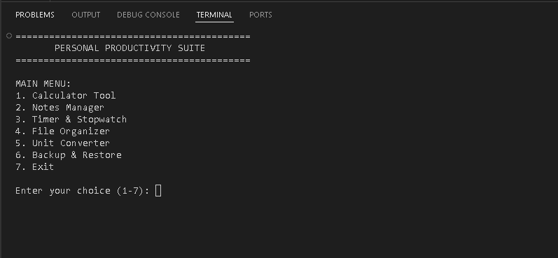
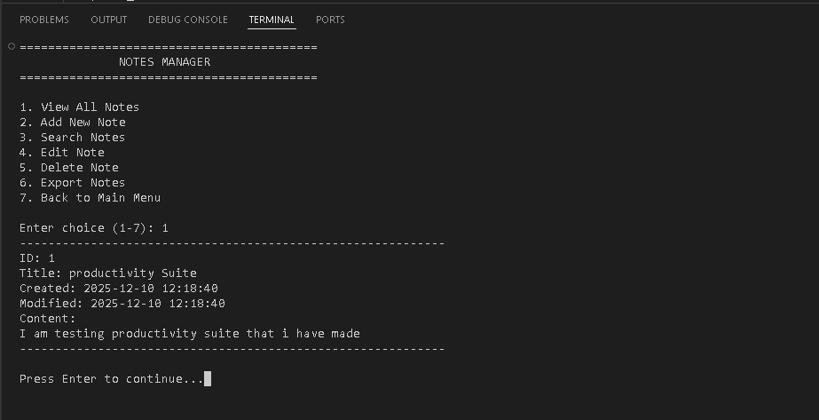
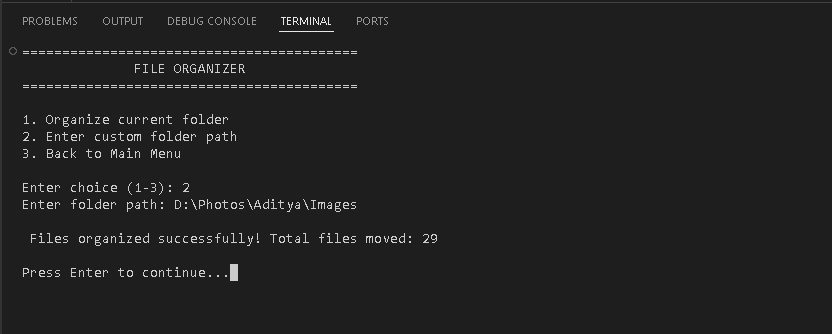
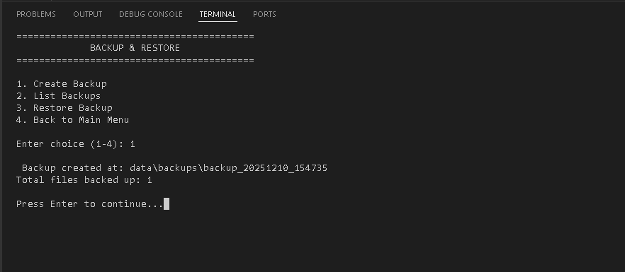

# 🧰 Personal Productivity Suite (Python CLI)

A complete command-line based productivity application that includes:
Calculator, Notes Manager, Timer, File Organizer, Unit Converter, and Backup & Restore tools — built using Python, modular architecture, file handling, OOP and CLI UI.

> Month 1 Task Submission – The Developers Arena Internship 🚀

# 🌟 Features

### ✔ Calculator
- Basic operations
- Division by zero handling

### ✔ Notes Manager
- Create, view, search, edit, delete notes
- Stored in JSON
- Export to TXT / CSV

### ✔ Timer & Stopwatch
- Countdown timer
- Stopwatch

### ✔ File Organizer
- Automatically detects file types
- Moves to categorized folders

### ✔ Unit Converter
- Length conversion
- Weight conversion
- Temperature conversion

### ✔ Backup & Restore
- Timestamped backups
- Restore previous data safely

# 📂 Project Structure

```

personal_productivity_suite/
│ main.py
│ README.md
| requirements.txt
│
├─ modules/
    │   calculator.py
    │   notes_manager.py
    │   timer.py
    │   file_organizer.py
    │   unit_converter.py
    │   backup_manager.py
    │   utils.py
│
├─ data/
    │   notes.json
    │   backups/
│
└─ docs/
    |   installation_guide.md
    |   user_manual.md
    |   modules_overview.md
    |   troubleshooting.md
    |   testing_evidence.md

````


# 🖥 Screenshots  

### Main Menu  


### Notes Manager  


### File Organizer  


### Backup Created  



# 🔧 Installation & Setup

### Requirements
- Python 3.8+
- VS Code (recommended)


## Step-1: Clone repository

```bash
git clone https://github.com/cyberfortify/productivity_suite.git
````

Or download ZIP from GitHub.


## Step-2: Run program

```bash
python main.py
```


# 👨‍💻 Usage

### Run application:

```bash
python main.py
```

From menu choose:
1- Calculator
2- Notes
3- Timer
4- Organizer
5- Unit Converter
6- Backup
7- Exit


# 📑 Documentation (Fully Included)

All documentation available in **/docs**

* installation guide
* user manual
* modules overview
* troubleshooting
* testing evidence


# 🏗 Technologies Used

* Python 3
* JSON, TXT, CSV
* os, shutil, pathlib
* datetime
* OOP & CLI UI

# 🧠 Concepts Practiced

* Modular programming
* File handling
* JSON persistence
* Command-line interface
* Object-Oriented Programming
* Error handling
* Export functionality
* Backups
* Testing scripts
* Documentation

# 🧪 Testing

### Automated Tests

Inside /tests:

```bash
python tests/test_calculator.py
python tests/test_notes_manager.py
```

### Manual Test Evidence inside:

```
docs/testing_evidence.md
```


# 🙋‍♂️ Author

👤 Aditya Vishwakarma
📧 work.aditya2010@gmail.com
🔗 https://github.com/cyberfortify
🔗 https://www.linkedin.com/in/imadityavk


# ⭐ If you like this project

⭐ Star this repo
🔁 Fork
🌟 Share
